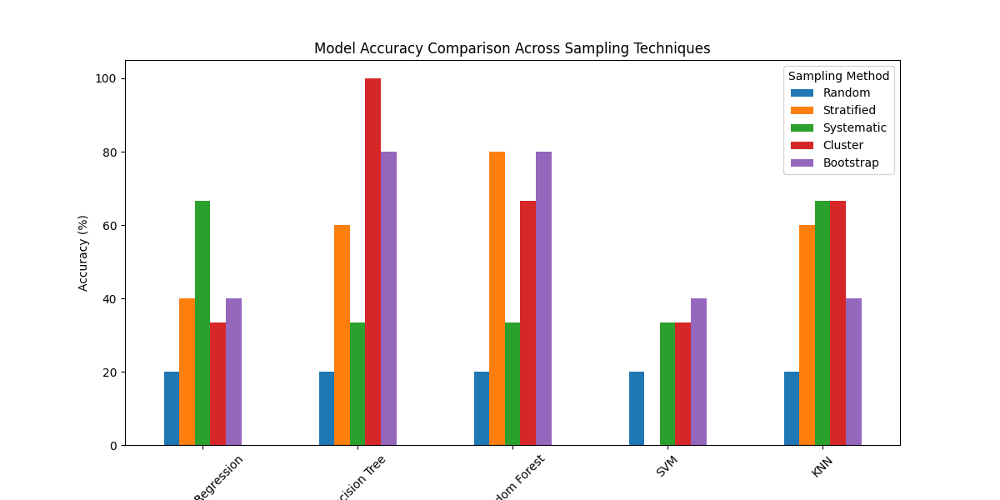
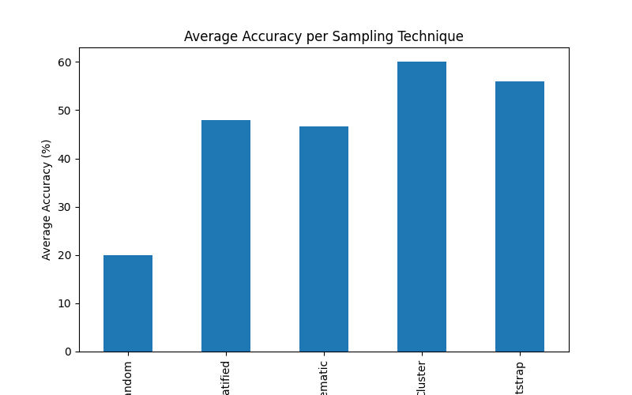

### Sampling techniques on ML models
This project evaluates how different statistical sampling techniques influence the performance of machine learning models on an imbalanced credit card fraud dataset.

---

## Problem Statement

Credit card fraud datasets are highly imbalanced, where fraudulent transactions represent a very small portion of the data.  
This project explores how different sampling strategies impact model performance.

---

## Dataset

- Source: Credit Card Fraud Dataset
- Binary Classification:
  - 0 → Non-Fraud
  - 1 → Fraud
- Original dataset was imbalanced.
- Downsampling was applied to create a balanced dataset before sampling.

---

## Sampling Techniques Implemented

1. **Random Sampling**
2. **Stratified Sampling**
3. **Systematic Sampling**
4. **Cluster Sampling (KMeans-based)**
5. **Bootstrap Sampling**

---

## Machine Learning Models Used

- Logistic Regression
- Decision Tree
- Random Forest
- Support Vector Machine (SVM)
- K-Nearest Neighbors (KNN)

---

## Model Accuracy Comparison

### Accuracy Comparison Across Sampling Techniques

---

### Average Accuracy per Sampling Technique

---

## Key Observations
-Cluster Sampling yielded the highest overall average accuracy among all sampling techniques. This suggests that grouping similar transactions before sampling can enhance model learning by preserving underlying data structure.

-Bootstrap Sampling demonstrated consistently strong performance, indicating that sampling with replacement can provide stable training subsets and improve model generalization.

-Stratified Sampling maintained class balance effectively and produced reliable results, particularly for ensemble-based models such as Random Forest and Decision Tree.

-Systematic Sampling showed moderate performance, with relatively better outcomes for Logistic Regression and KNN. However, its effectiveness may depend on the original ordering of the dataset.

-Random Sampling resulted in the lowest overall accuracy, highlighting that purely random subset selection may fail to preserve meaningful data patterns in fraud detection tasks.

-The Decision Tree model achieved 100% accuracy under Cluster Sampling, which may indicate overfitting due to highly homogeneous cluster-based subsets.

-Random Forest exhibited the most stable performance across different sampling techniques, demonstrating robustness to variations in data selection strategy.

-The SVM model consistently showed comparatively lower accuracy, possibly due to sensitivity to dataset size, feature scaling, and class distribution characteristics.

## Author

Aarushi Rawal  
